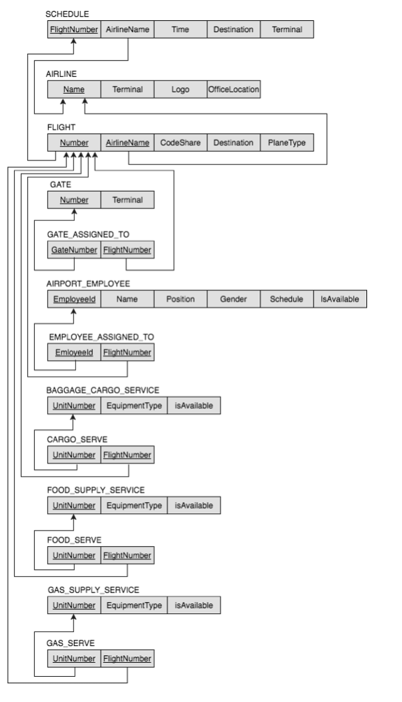

# JDBC Project

This is my Database project that uses JDBC API.

This application speaks to Oracle database. It has the following features:

- Gets the flight schedule for today
- Gets all services assigned to flights
- Inserts new flight to the schedule

Here you can find the relational schema of the database this application works with

